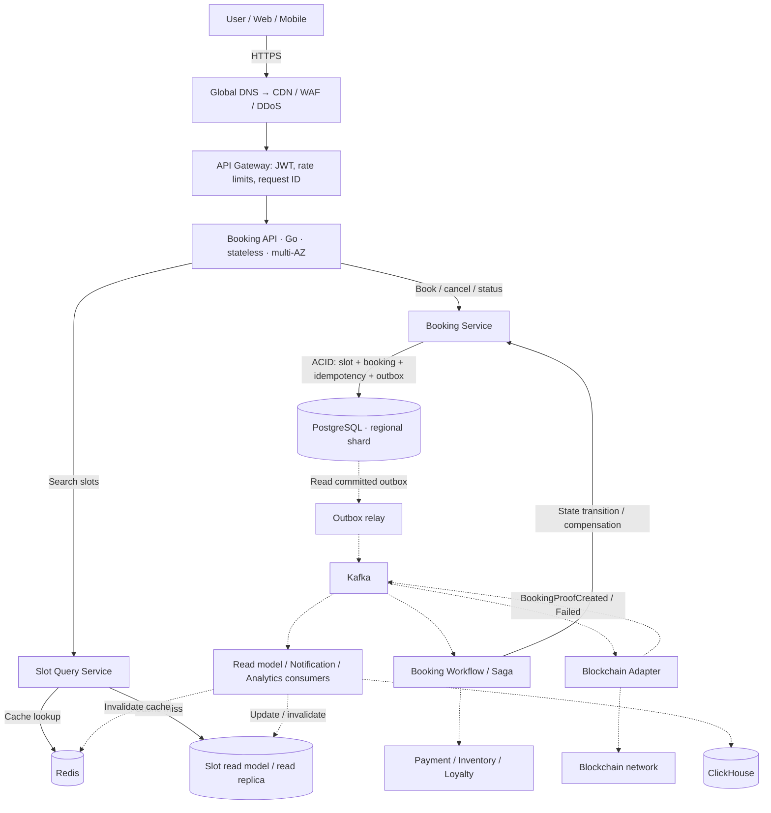
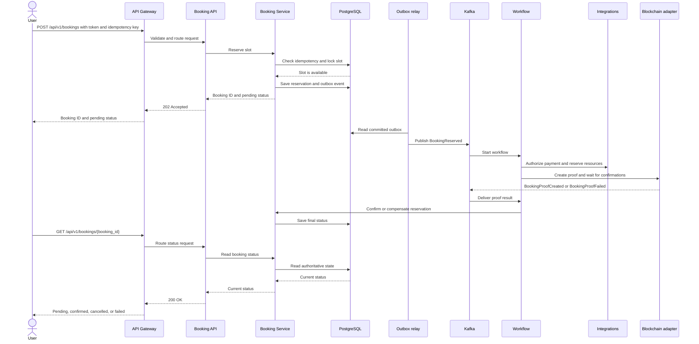

# System Design: Slot Booking System

Status: draft  
Version: 0.1  
Date: 2026-09-30

## 1. Goal and scope

The service accepts external requests to search and book time slots. Confirmed bookings require strong consistency and zero overbooking. The domain includes slots, availability, bookings, cancellations, and integrations with payment, loyalty, and inventory.

The recommended first release is a modular set of Go services with explicit domain boundaries. Physical service separation can be introduced incrementally: isolate the booking critical path first, while secondary capabilities may remain in one deployable module.

## 2. Requirements and assumptions

### Functional requirements

1. Search available slots by region, resource, time range, and filters.
2. Create a booking for an available slot.
3. Cancel a booking according to cancellation policy.
4. Return the original result for retries with the same idempotency key.
5. Publish booking events for payment, loyalty, notifications, and analytics.
6. Support OAuth 2.0 / OpenID Connect and GDPR data-subject operations.

### Non-functional targets

| Area | Target |
|---|---|
| Booking API | p95 ≤ 500 ms at 10,000 RPS |
| Search | ≤ 1 s with 50,000 concurrent users |
| Peak load | 20,000 read TPS, 10,000 write TPS |
| Availability | 99.98% SLA; remain operational after one AZ loss |
| Recovery | RTO ≤ 5 minutes, RPO ≤ 1 minute |
| Scaling | up to 100 application nodes, ≤10% degradation |
| Cold start | new node ready within 30 seconds |
| Security | TLS 1.3, AES-256 at rest, DDoS protection up to 1 Tbps |
| Observability | Prometheus ≤10 s, logs ≤5 s, tracing 100% errors / 1% success |
| Delivery | commit-to-production ≤30 minutes, zero downtime |

## 3. High-level architecture



Solid arrows show requests and storage access; dashed arrows show background processing. API responses return to the user through the Gateway. Redis and the read model accelerate searches; PostgreSQL validates reservation eligibility. The outbox relay publishes events only after commit. Kafka, blockchain, and ClickHouse are outside the synchronous HTTP response path.

Observability: OpenTelemetry → Prometheus + Loki/ELK + Jaeger. Platform: Kubernetes, HPA, replication, and backups.

### Core components

- **Edge layer:** CDN, WAF, managed DDoS protection, and API Gateway. It performs TLS termination, JWT validation, rate limiting, request-size limits, and correlation IDs.
- **Booking API:** stateless Go HTTP/gRPC API, horizontally scalable to 100 nodes.
- **Slot Query Service:** optimized read path. It caches derived data; the cache is never the source of truth.
- **Booking Service:** sole owner of booking and slot state transitions.
- **Booking database:** PostgreSQL-compatible strongly consistent cluster with multi-AZ synchronous replication. Shard by `region_id`; each shard has a primary and standby.
- **ClickHouse:** analytical store for events, history, reports, and high-volume aggregates. It is not used for booking concurrency and is not the source of truth.
- **Redis:** availability cache, rate-limit counters, and short-lived reservation views. Redis loss must never cause overbooking.
- **Event bus:** managed Kafka-compatible service with redelivery.
- **Outbox relay:** publishes events after the database commit, avoiding the dual-write problem.
- **Workflow/Saga workers:** asynchronously coordinate payment, loyalty, and inventory.
- **Blockchain Adapter:** a separate Go component that creates an external unique token/record after the local booking commit, tracks confirmations, and stores the transaction reference.

## 4. Booking flow

1. The client sends `POST /api/v1/bookings` with an `Idempotency-Key`, slot data, and an access token.
2. The gateway validates the token, limits, and request size, then routes through Booking API to the regional Booking Service.
3. In one transaction, Booking Service checks idempotency, locks the slot (`SELECT ... FOR UPDATE` or conditional update), validates availability and expiry, sets the slot to `RESERVED`, creates a `PENDING_CONFIRMATION` booking and an outbox event, then commits. A retry returns the original result; an unavailable slot returns `409 Conflict`.
4. The API returns `202 Accepted` with a booking ID and `PENDING_CONFIRMATION`. Saga creation alone is not final confirmation.
5. After commit, the outbox relay publishes `BookingReserved` to Kafka. Workflow executes mandatory payment, inventory, and loyalty steps with timeouts, retries, and compensation; Blockchain Adapter creates a proof without PII and waits for confirmations.
6. The adapter publishes `BookingProofCreated` or `BookingProofFailed`. Workflow uses Booking Service to set `CONFIRMED` only after all mandatory steps succeed; failures trigger compensation, release the slot, and set `CANCELLED` or `FAILED`.
7. The client retrieves the current status with `GET /api/v1/bookings/{booking_id}`.

Overbooking is prevented by the database, not by cache or a distributed lock service. Active-booking uniqueness and a row version provide an additional guard.

Blockchain proves ticket entitlement and protects against forged proofs, but it does not replace the local PostgreSQL transaction: the external network has latency, fees, finality/reorg semantics, and outages. Kafka redelivery and blockchain proof creation must be idempotent.

### User request sequence



The initial `202 Accepted` means the slot is reserved and confirmation is still in progress. The user retrieves the current status with a separate GET request. `CONFIRMED` requires all mandatory Saga steps and blockchain proof; failures trigger compensation. A retry with the same key and payload returns the stored result.

## 5. API contract

Base prefix: `/api/v1`. Contracts must remain backward-compatible with at least two previous versions.

```http
GET  /api/v1/slots?region_id=eu-1&resource_id=r1&status=AVAILABLE&from=...&to=...
POST /api/v1/bookings
GET  /api/v1/bookings/{booking_id}
POST /api/v1/bookings/{booking_id}/cancel
```

Write requests require `Idempotency-Key`. Errors use stable machine-readable codes. Pagination and time ranges are bounded. `202 Accepted` is used for asynchronous confirmation; `409 Conflict` means the slot is already taken.

## 6. Data model

Core tables:

- `slots(id, region_id, resource_id, starts_at, ends_at, status, version)`;
- `bookings(id, slot_id, customer_ref, status, idempotency_key, created_at, expires_at)`;
- `booking_steps(booking_id, step, status, attempt, last_error)`;
- `idempotency_keys(key, request_hash, response_payload, expires_at)`;
- `outbox_events(id, aggregate_id, type, payload, published_at, created_at)`.
- `blockchain_proofs(booking_id, chain_id, token_id, tx_hash, status, confirmations, created_at, confirmed_at)`.

Constraints: unique active booking per `slot_id`; unique `(tenant_id, idempotency_key)`; foreign keys within a shard; UTC timestamps; minimized PII separated from operational identifiers. History and audit logs are immutable.

### Storage responsibility split

| Task | System | Reason |
|---|---|---|
| Booking, slot, idempotency, Saga, and blockchain state | PostgreSQL | ACID, locks, unique constraints |
| Availability cache and rate limits | Redis | low latency and TTL |
| Reports, history, metrics, and analytics | ClickHouse | columnar storage and fast aggregations |
| Cross-service events and delivery | Kafka | partition ordering, replay, and DLQ |

Events reach ClickHouse through Kafka consumers. This is eventual consistency and ingestion lag is monitored separately. ClickHouse unavailability must not block booking.

## 7. Consistency and Saga

The slot and booking local transaction is ACID and strongly consistent. The cross-service operation is a Saga orchestrated by Booking Workflow.

| Step | Success | Compensation |
|---|---|---|
| Reserve slot | slot RESERVED | release slot |
| Authorize payment | payment AUTHORIZED | void/refund |
| Reserve inventory | inventory RESERVED | release inventory |
| Apply loyalty | points RESERVED | release points |
| Confirm booking | booking CONFIRMED | operator-driven cancellation workflow |

Every consumer is idempotent. Events carry `event_id`, `aggregate_id`, `schema_version`, and correlation/causation IDs. A DLQ and replay process are mandatory.

Blockchain is a mandatory Saga step between local reservation and final confirmation. If proof creation fails after the retry policy, compensate and release the slot. For an already-created token, use a revoke/void record or an off-chain status because on-chain data is immutable.

## 8. Event architecture and protocols

Kafka transports domain and integration events; it is not used for synchronous API responses. Each event envelope contains `event_id`, `event_type`, `schema_version`, `aggregate_id`, `occurred_at`, `correlation_id`, `causation_id`, `producer`, and payload. Partition by `booking_id` or `slot_id` to preserve aggregate order.

REST serves external APIs and webhooks; gRPC serves typed, low-latency calls between Go services. Long-running operations and fan-out use Kafka. Use Protobuf/Buf for gRPC and versioned JSON/Avro/Protobuf schemas for Kafka. Breaking changes are forbidden within supported versions.

Kafka does not lock slots: commit to PostgreSQL first, then publish through the transactional outbox.

## 9. Scaling and performance

- Scale reads with read replicas, Redis, and a denormalized availability read model.
- Shard writes geographically; route by `region_id` so the booking transaction stays local.
- Protect hot slots with admission control, per-slot queues, and short TTL reservations without violating fairness.
- Require connection pooling, prepared statements, bounded goroutine pools, and backpressure.
- HPA uses CPU >70%, RPS, latency, and queue depth; response within two minutes. Read and write deployments scale independently.
- Load tests must cover 10k booking RPS, 20k read TPS, 50k concurrent search users, AZ failure, hot-key contention, and retry storms.

## 10. Reliability, DR, and graceful degradation

The primary region spans at least three AZs. After one AZ loss, the load balancer shifts traffic and the database retains quorum. For a regional outage, use a warm standby/secondary region, global DNS failover, and regular restore drills. WAL/logical replication and backups target RPO ≤1 minute; automated failover and runbooks target RTO ≤5 minutes.

Under overload, disable recommendations, extended analytics, and non-essential notifications. Search may return cached data with an explicit `stale` marker, but booking confirmation always uses the authoritative database.

## 11. Security and privacy

- OIDC JWT validation at the gateway with a local JWKS cache; target token verification latency <50 ms.
- TLS 1.3 end to end; AES-256 at rest, KMS-managed keys, rotation, and least-privilege IAM.
- WAF, bot protection, per-user/IP/tenant rate limits, and managed scrubbing for attacks up to 1 Tbps.
- Secrets in a managed secret store; no PII in logs or traces.
- GDPR: purpose limitation, retention policy, export/delete workflow, pseudonymization, audit trail, and regional data residency.

## 12. Observability and SLOs

Every request gets a `request_id`, `trace_id`, `tenant_id`, and safe `booking_id`. Metrics include RPS, p50/p95/p99 latency, error rate, booking conflicts, idempotency hits, DB lock wait, replication lag, queue lag, Saga duration, cache hit ratio, and saturation. Prometheus scrape interval is ≤10 seconds; logs reach Loki/ELK within ≤5 seconds. OpenTelemetry sampling is 100% for errors and 1% for successful bookings.

Alert when booking p95 latency exceeds one second continuously for one minute. Page on error-budget burn, DB quorum loss, replication lag, outbox lag, and DLQ growth.

## 13. Deployment and compatibility

Build multi-stage Go container images. Readiness checks critical-path dependencies; liveness must not restart slow but healthy processes. Use canary/blue-green rollout and automatic rollback on SLO violations. Apply expand/contract migrations. CI includes lint, unit/integration/contract/load-smoke/security tests; target commit-to-production is ≤30 minutes. Version APIs and events; support at least two previous versions.

## 14. Open decisions and delivery plan

Clarify tenant/resource model, time-zone and DST rules, maximum hold duration, payment policy, multi-region write requirements, and cloud provider.

Phases: (1) ADRs and API/schema; (2) single-region multi-AZ MVP with PostgreSQL, outbox, and idempotency; (3) Redis/read model and load tests; (4) Saga integrations; (5) multi-region/sharding, DR drills, GDPR automation; (6) production hardening and chaos testing.

## 15. Implementation sequence

Work in vertical slices: each phase must end with a working, testable scenario rather than infrastructure alone.

1. **Record domain decisions and boundaries.** Write ADRs for the tenant/resource model, time zones, slot and booking states, hold TTL, cancellation policy, idempotency, and final-confirmation criteria. The result is an agreed API, event schemas, and an explicit list of open decisions.
2. **Create the Go application skeleton.** Set up modules, configuration, structured logging, health/readiness endpoints, error handling, correlation IDs, and CI with lint and unit tests. The result is a runnable service and reproducible build.
3. **Implement the PostgreSQL model.** Add migrations for `slots`, `bookings`, `booking_steps`, `idempotency_keys`, and `outbox_events`, together with indexes and constraints. Verify UTC timestamps, active-booking uniqueness, and safe schema expansion.
4. **Implement the synchronous booking critical path.** Build `POST /api/v1/bookings`, `GET /api/v1/bookings/{booking_id}`, and cancellation. In one transaction, check idempotency, lock the slot, create the booking, and write the outbox event. Add concurrency tests for two requests targeting one slot.
5. **Add the transactional outbox and Kafka.** Implement the relay, event envelope, redelivery, DLQ, and idempotent consumers. Version schemas and carry correlation/causation IDs.
6. **Add search and the read path.** Implement `GET /api/v1/slots`, a read model, Redis caching with TTL, and invalidation. Verify that cache misses and Redis loss do not change booking rules.
7. **Add the Workflow/Saga.** Implement step state, timeouts, exponential-backoff retries, retry budgets, and compensating actions for payment, inventory, and loyalty. Make event reprocessing safe.
8. **Integrate blockchain proof.** Build the separate adapter, use an opaque claim hash without PII, wait for confirmations, handle reorgs/timeouts, and publish `BookingProofCreated` / `BookingProofFailed`. Set `CONFIRMED` only after all mandatory steps succeed.
9. **Add observability and security.** Connect OpenTelemetry, metrics, and alerts; configure JWT/OIDC, rate limits, a secret store, TLS, PII redaction, and an audit trail.
10. **Prepare production deployment.** Build container images and Kubernetes manifests, configure multi-AZ PostgreSQL, HPA, backup/restore, expand/contract migrations, and canary/rollback. Run API and worker deployments separately.
11. **Verify reliability and performance.** Run load tests, hot-slot contention, retry storms, Redis/Kafka/AZ failure tests, backup restores, and DLQ replay. Confirm SLO, RTO, and RPO with measurements.
12. **Expand to multi-region and compliance.** Add `region_id` routing, warm standby, DNS failover, GDPR export/delete, retention, and regular DR/chaos drills. Open production traffic gradually afterward.

The exit criterion for each phase is an automated check of the previous scenario and a runbook for its failures. Release the single-region MVP first (steps 1–6), then integrations and blockchain (7–8), then production hardening and multi-region (9–12).
