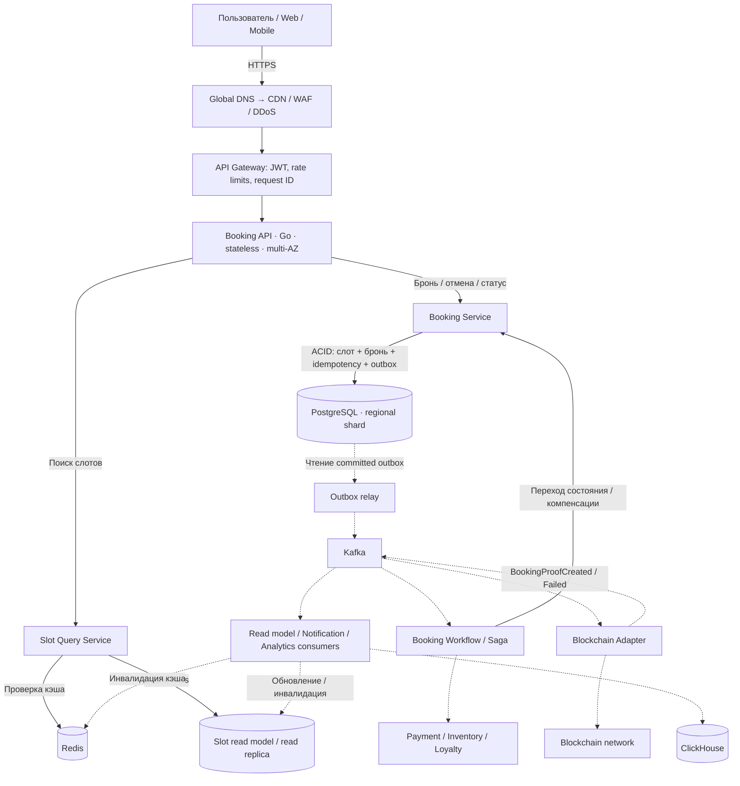
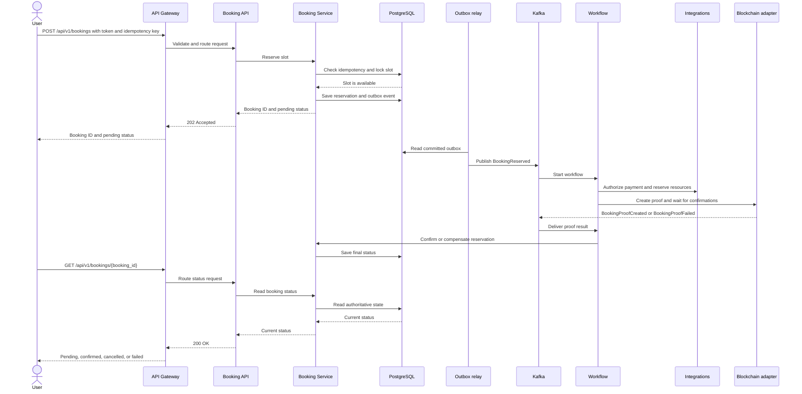

# System Design: система бронирования слотов

Статус: draft  
Версия: 0.1  
Дата: 2026-09-30

## 1. Цель и область системы

Сервис принимает внешние запросы на поиск и бронирование временных слотов. Для подтверждённой брони система гарантирует строгую согласованность и отсутствие овербукинга. В состав домена входят слоты, доступность, брони, отмены и интеграции с оплатой, лояльностью и инвентарём.

Рекомендованный первый релиз — модульный набор Go-сервисов с чёткими границами домена. Физическое разделение сервисов выполняется постепенно: критический путь бронирования отделяется первым, второстепенные функции могут оставаться внутри одного deployable-модуля.

## 2. Требования и допущения

### Функциональные требования

1. Искать доступные слоты по региону, ресурсу, диапазону времени и фильтрам.
2. Создавать бронь на свободный слот.
3. Отменять бронь согласно политике отмены.
4. Повтор запроса с тем же idempotency key возвращает исходный результат и не создаёт дубликат.
5. Публиковать события бронирования для оплаты, лояльности, уведомлений и аналитики.
6. Поддерживать OAuth 2.0 / OpenID Connect и GDPR-операции над персональными данными.

### Нефункциональные цели

| Область | Цель |
|---|---|
| API бронирования | p95 ≤ 500 мс при 10 000 RPS |
| Поиск | ≤ 1 с при 50 000 одновременных пользователей |
| Пиковая нагрузка | 20 000 read TPS, 10 000 write TPS |
| Доступность | SLA 99.98%, потеря одной AZ не должна останавливать сервис |
| Восстановление | RTO ≤ 5 минут, RPO ≤ 1 минуты |
| Масштабирование | до 100 application nodes, деградация не более 10% |
| Cold start | готовность нового узла ≤ 30 секунд |
| Безопасность | TLS 1.3, AES-256 at rest, DDoS-защита до 1 Tbps |
| Наблюдаемость | Prometheus ≤ 10 с, логи ≤ 5 с, tracing 100% ошибок / 1% успехов |
| Доставка | CI/CD от коммита до production ≤ 30 минут, zero downtime |

## 3. Архитектура высокого уровня



Сплошные стрелки показывают путь запросов и обращений к хранилищам; пунктирные — фоновую обработку. Ответ API возвращается пользователю через Gateway. Redis и read model ускоряют поиск; право на резервирование проверяется в PostgreSQL. Outbox relay публикует события только после commit. Kafka, blockchain и ClickHouse не входят в синхронный путь HTTP-ответа.

Наблюдаемость: OpenTelemetry → Prometheus + Loki/ELK + Jaeger. Платформа: Kubernetes, HPA, репликация и резервные копии.

### Основные компоненты

- **Edge layer:** CDN, WAF, managed DDoS protection и API Gateway. Он выполняет TLS termination, JWT validation, rate limiting, request size limits и correlation ID.
- **Booking API:** stateless Go HTTP/gRPC API; горизонтальное масштабирование до 100 узлов.
- **Slot Query Service:** оптимизированный read path. Кэширует только производные данные; кэш не является источником истины.
- **Booking Service:** единственный владелец переходов состояния брони и резерва слота.
- **Booking database:** PostgreSQL-compatible strongly consistent кластер в регионе с multi-AZ synchronous replication. Шардирование — по `region_id`; каждый shard имеет primary и standby.
- **ClickHouse:** аналитическое хранилище для событий, истории, отчётов и high-volume агрегатов. Не используется для конкурентного бронирования и не является источником истины.
- **Redis:** кэш доступности, rate-limit counters и короткоживущие reservation views. Потеря Redis не должна приводить к овербукингу.
- **Event bus:** Kafka-compatible managed service для событий и повторной доставки.
- **Outbox relay:** публикует события после commit транзакции, устраняя dual-write проблему.
- **Workflow/Saga workers:** асинхронно координируют оплату, лояльность и инвентарь.
- **Blockchain Adapter:** отдельный Go-компонент, который создаёт внешний уникальный token/record после локального commit брони, отслеживает confirmations и сохраняет ссылку на транзакцию.

## 4. Ключевой поток бронирования

1. Клиент отправляет `POST /api/v1/bookings` с `Idempotency-Key`, данными слота и access token.
2. Gateway проверяет токен, лимиты и размер запроса, затем направляет запрос через Booking API в Booking Service нужного региона.
3. Booking Service в одной транзакции проверяет idempotency, блокирует слот (`SELECT ... FOR UPDATE` или conditional update), проверяет доступность и срок действия, переводит слот в `RESERVED`, создаёт бронь `PENDING_CONFIRMATION` и outbox event, затем выполняет commit. Повтор возвращает исходный результат; занятый слот — `409 Conflict`.
4. API возвращает `202 Accepted` с booking ID и `PENDING_CONFIRMATION`. Создание Saga ещё не означает подтверждение брони.
5. Outbox relay публикует `BookingReserved` в Kafka после commit. Workflow выполняет обязательные шаги оплаты, инвентаря и лояльности с timeout, retry и компенсациями; Blockchain Adapter создаёт proof без PII и ожидает confirmations.
6. Адаптер публикует `BookingProofCreated` или `BookingProofFailed`. Workflow через Booking Service устанавливает `CONFIRMED` только после успеха всех обязательных шагов; при ошибке выполняет компенсации, освобождает слот и устанавливает `CANCELLED` или `FAILED`.
7. Клиент запрашивает текущий статус через `GET /api/v1/bookings/{booking_id}`.

Овербукинг предотвращается базой данных, а не кэшем или распределённым lock-сервисом. Для одного слота действует уникальность активной брони и версия строки (`optimistic concurrency` как дополнительный guard).

Блокчейн подтверждает право на билет и защищает от подделки proof, но не заменяет локальную транзакцию PostgreSQL: внешняя сеть имеет задержку, комиссии, finality/reorg semantics и может быть недоступна. Повторная обработка Kafka-события и создание blockchain proof должны быть идемпотентными.

### Как проходит запрос пользователя



Первый ответ `202 Accepted` означает, что слот зарезервирован, но подтверждение ещё выполняется. Пользователь получает актуальный статус отдельным GET-запросом. `CONFIRMED` возможен только после всех обязательных шагов Saga и blockchain proof; при ошибке выполняются компенсации. Повтор с тем же ключом и тем же содержимым возвращает сохранённый результат.

## 5. API-контракт

Базовый префикс: `/api/v1`. Контракты должны быть backward-compatible минимум с двумя предыдущими версиями.

```http
GET  /api/v1/slots?region_id=eu-1&resource_id=r1&status=AVAILABLE&from=...&to=...
POST /api/v1/bookings
GET  /api/v1/bookings/{booking_id}
POST /api/v1/bookings/{booking_id}/cancel
```

Пример запроса:

```json
{
  "slot_id": "slot_123",
  "customer_id": "customer_456",
  "resource_id": "resource_789"
}
```

Правила API: `Idempotency-Key` обязателен для write-запросов; ошибки используют стабильные machine-readable codes; pagination и time ranges ограничены; `202 Accepted` применяется для асинхронного подтверждения; `409 Conflict` означает, что слот уже занят.

## 6. Модель данных

Ключевые таблицы:

- `slots(id, region_id, resource_id, starts_at, ends_at, status, version)`;
- `bookings(id, slot_id, customer_ref, status, idempotency_key, created_at, expires_at)`;
- `booking_steps(booking_id, step, status, attempt, last_error)`;
- `idempotency_keys(key, request_hash, response_payload, expires_at)`;
- `outbox_events(id, aggregate_id, type, payload, published_at, created_at)`.
- `blockchain_proofs(booking_id, chain_id, token_id, tx_hash, status, confirmations, created_at, confirmed_at)`.

Ограничения: unique `(slot_id)` для активной брони; unique `(tenant_id, idempotency_key)`; foreign keys внутри shard; UTC timestamps; персональные данные минимизируются и отделяются от операционных идентификаторов. История и audit log immutable.

### Разделение ответственности хранилищ

| Задача | Система | Причина |
|---|---|---|
| Бронь, слот, idempotency, Saga и blockchain state | PostgreSQL | ACID, блокировки, уникальные ограничения |
| Кэш доступности и rate limits | Redis | низкая задержка и TTL |
| Отчёты, история, метрики и аналитика | ClickHouse | columnar storage и быстрые агрегаты |
| События и доставка между сервисами | Kafka | partition ordering, replay и DLQ |

События доставляются в ClickHouse через Kafka consumers. Это eventual consistency; ingestion lag измеряется отдельно. Недоступность ClickHouse не блокирует бронирование.

## 7. Согласованность и Saga

Локальная транзакция брони и слота — ACID и strong consistency. Межсервисная операция — Saga с orchestration в Booking Workflow. Пример компенсаций:

| Шаг | Успех | Компенсация |
|---|---|---|
| Reserve slot | слот RESERVED | release slot |
| Authorize payment | payment AUTHORIZED | void/refund |
| Reserve inventory | inventory RESERVED | release inventory |
| Apply loyalty | points RESERVED | release points |
| Confirm booking | booking CONFIRMED | отмена через operator workflow |

Все consumer handlers идемпотентны, события имеют `event_id`, `aggregate_id`, `schema_version` и correlation/causation IDs. DLQ и replay обязательны.

Blockchain — отдельный обязательный шаг Saga между локальной резервацией и окончательным подтверждением. Если proof не создан после retry policy, выполняются компенсации и слот освобождается. Для уже созданного token используется revoke/void запись или off-chain статус, потому что on-chain данные неизменяемы.

## 8. Event architecture и протоколы

Kafka — транспорт доменных и интеграционных событий, а не механизм синхронного ответа API. Envelope события: `event_id`, `event_type`, `schema_version`, `aggregate_id`, `occurred_at`, `correlation_id`, `causation_id`, `producer`, payload. Ключ партиционирования — `booking_id` или `slot_id`.

REST используется для внешнего API и webhooks; gRPC — для typed low-latency вызовов между Go-сервисами. Долгие операции и fan-out выполняются через Kafka. Для gRPC применяются Protobuf/Buf, для Kafka — versioned JSON/Avro/Protobuf schemas. Breaking changes запрещены в поддерживаемых версиях.

Kafka не участвует в блокировке слота: сначала commit в PostgreSQL, затем публикация через transactional outbox.

## 9. Масштабирование и производительность

- Read path масштабируется через read replicas, Redis и денормализованный availability read model.
- Write path шардируется по географии; запросы маршрутизируются по `region_id`, чтобы сохранить локальность транзакции.
- Hot slots защищаются admission control, per-slot queue и коротким TTL reservation; лимиты не должны нарушать fairness.
- Connection pooling, prepared statements, bounded goroutine pools и backpressure обязательны.
- HPA масштабирует по CPU >70%, RPS, latency и queue depth; реакция ≤2 минут. Read/write deployments масштабируются независимо.
- Нагрузочные тесты: 10k booking RPS, 20k read TPS, 50k concurrent search users, AZ failure, hot-key contention и retry storm.

## 10. Надёжность, DR и graceful degradation

Рабочий регион развёрнут минимум в трёх AZ. При потере одной AZ трафик перераспределяется через load balancer, а база сохраняет quorum. Для региональной аварии используется warm standby/secondary region, глобальный DNS failover и регулярные restore drills. WAL/логическая репликация и backup policy обеспечивают RPO ≤1 минуты; автоматизированный failover и runbook — RTO ≤5 минут.

При перегрузке отключаются рекомендации, расширенная аналитика и необязательные уведомления. Поиск может отдавать кэшированные данные с явным `stale` признаком, но подтверждение брони всегда проходит через authoritative database.

## 11. Безопасность и приватность

- OIDC JWT validation на gateway с локальным JWKS cache; target verification latency <50 мс.
- TLS 1.3 end-to-end; AES-256 encryption at rest, KMS-managed keys, rotation и least privilege IAM.
- WAF, bot protection, per-user/IP/tenant rate limits и managed scrubbing для атак до 1 Tbps.
- Secrets в managed secret store; PII не попадает в логи и tracing.
- GDPR: purpose limitation, retention policy, export/delete workflow, pseudonymization, audit trail и data residency по региону.

## 12. Наблюдаемость и SLO

Каждый запрос получает `request_id`, `trace_id`, `tenant_id` и безопасный `booking_id`. Метрики: RPS, p50/p95/p99 latency, error rate, booking conflicts, idempotency hits, DB lock wait, replication lag, queue lag, Saga duration, cache hit ratio и saturation. Prometheus scrape interval ≤10 секунд; логи поступают в Loki/ELK ≤5 секунд. OpenTelemetry sampling: 100% errors, 1% successful booking traces.

Алерт: p95 booking latency >1 секунды непрерывно 1 минуту. Дополнительные paging alerts — error budget burn, DB quorum, replication lag, outbox lag и DLQ growth.

## 13. Развёртывание и совместимость

Контейнеры Go собираются в multi-stage image; readiness проверяет зависимости критического пути, liveness не перезапускает медленные, но живые процессы. Canary/blue-green rollout, автоматический rollback по SLO, миграции по схеме expand/contract. CI включает lint, unit/integration/contract/load smoke/security tests; целевой путь commit-to-prod ≤30 минут. API и события версионируются, минимум две предыдущие версии поддерживаются.

## 14. Открытые решения и план этапов

Нужно уточнить: модель tenant/resource, правила временных зон и DST, максимальную длительность hold, политику оплаты, требования к multi-region writes и облачного провайдера.

Этапы: (1) ADR и API/schema; (2) single-region multi-AZ MVP с PostgreSQL, outbox и идемпотентностью; (3) Redis/read model и нагрузочные тесты; (4) Saga integrations; (5) multi-region/sharding, DR drills, GDPR automation; (6) production hardening и chaos testing.

## 15. Последовательность реализации

Работу следует вести вертикальными срезами: каждый этап заканчивается работающим и проверяемым сценарием, а не только созданием инфраструктуры.

1. **Зафиксировать решения и границы домена.** Описать ADR для модели tenant/resource, временных зон, статусов слота и брони, TTL hold, политики отмены, идемпотентности и критериев финального подтверждения. Результат — согласованные API, схемы событий и список открытых решений.
2. **Создать каркас Go-приложения.** Настроить модули, конфигурацию, structured logging, health/readiness endpoints, обработку ошибок, correlation ID и базовый CI с lint и unit-тестами. Результат — запускаемый сервис и воспроизводимая сборка.
3. **Реализовать модель PostgreSQL.** Добавить миграции для `slots`, `bookings`, `booking_steps`, `idempotency_keys` и `outbox_events`, индексы и ограничения. Проверить UTC, уникальность активной брони и безопасное расширение схемы.
4. **Реализовать синхронный критический путь бронирования.** Сделать `POST /api/v1/bookings`, `GET /api/v1/bookings/{booking_id}` и отмену. В одной транзакции проверять idempotency, блокировать слот, создавать бронь и outbox event. Добавить тесты конкуренции двух запросов к одному слоту.
5. **Подключить transactional outbox и Kafka.** Реализовать relay, envelope событий, повторную доставку, DLQ и идемпотентных consumers. Зафиксировать schema version и correlation/causation IDs.
6. **Добавить поиск и read path.** Реализовать `GET /api/v1/slots`, read model, Redis cache с TTL и инвалидацией. Убедиться, что cache miss и потеря Redis не меняют правила бронирования.
7. **Добавить Workflow/Saga.** Реализовать состояния шагов, timeout, exponential backoff, retry budget и compensating actions для оплаты, inventory и loyalty. Сделать повторную обработку событий безопасной.
8. **Подключить blockchain proof.** Реализовать отдельный adapter, opaque claim hash без PII, ожидание confirmations, обработку reorg/timeout и события `BookingProofCreated` / `BookingProofFailed`. Переводить бронь в `CONFIRMED` только после всех обязательных шагов.
9. **Добавить наблюдаемость и безопасность.** Подключить OpenTelemetry, метрики и алерты; настроить JWT/OIDC, rate limits, secret store, TLS, redaction PII и audit trail.
10. **Подготовить production deployment.** Создать контейнеры, Kubernetes manifests, multi-AZ PostgreSQL, HPA, backup/restore, миграции expand/contract и canary/rollback. Настроить отдельные worker и API deployments.
11. **Проверить отказоустойчивость и производительность.** Выполнить нагрузочные тесты, hot-slot contention, retry storm, отказ Redis/Kafka/AZ, восстановление из backup и replay DLQ. Подтвердить SLO, RTO и RPO измерениями.
12. **Расширить до multi-region и compliance.** Добавить маршрутизацию по `region_id`, warm standby, DNS failover, GDPR export/delete, retention и регулярные DR/chaos drills. После этого открыть production traffic поэтапно.

Критерий перехода между этапами — автоматизированная проверка предыдущего сценария и наличие runbook для его отказов. Сначала следует выпускать single-region MVP (шаги 1–6), затем интеграции и blockchain (7–8), затем production hardening и multi-region (9–12).
